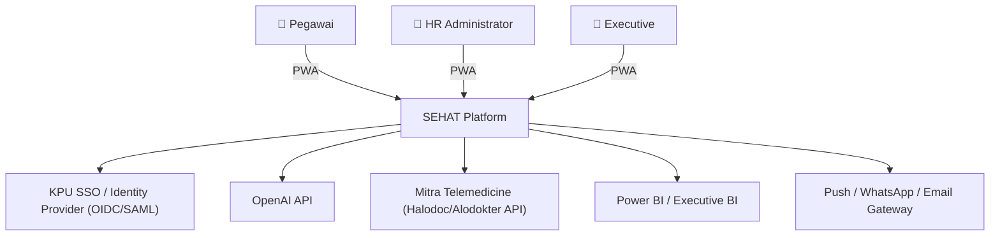
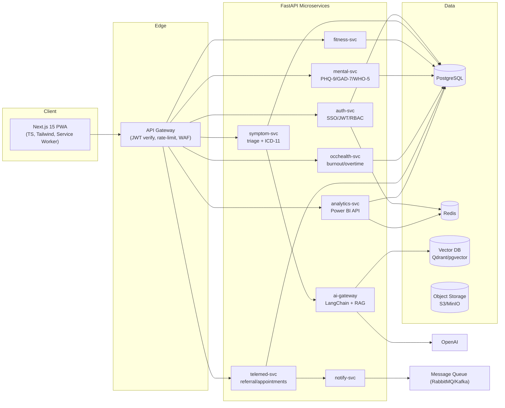
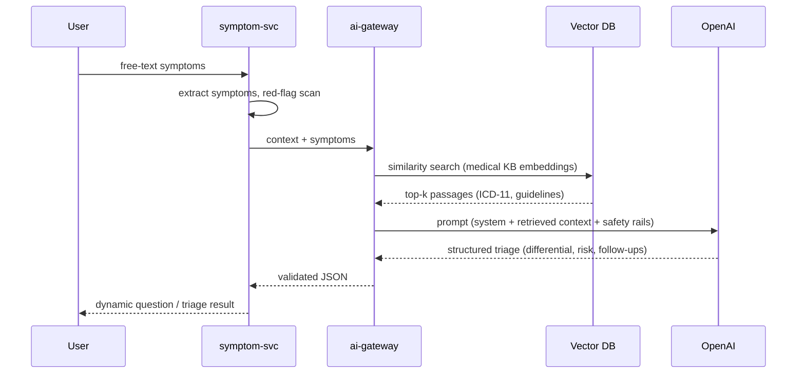

# SEHAT — System Architecture

> **Sistem Ekosistem Health, Analytics & Telemedicine** — Employee Health
> Intelligence Platform untuk KPU Indonesia.

This document describes the **full enterprise target architecture** and how the
**shipped PWA** (this repository) maps onto it. The shipped app is the
*cheapest deployable slice*: a 100% static, offline-capable PWA hosted on
GitHub Pages for **$0/month**, with all clinical logic running client-side.
The same UI contracts are designed to plug into the backend below with no UI
rewrite.

---

## 1. Two delivery modes

| | **Shipped now (this repo)** | **Full enterprise target** |
|---|---|---|
| Hosting | GitHub Pages / any static CDN ($0) | Kubernetes (GKE/EKS/AKS) |
| Frontend | Static PWA (vanilla ES modules) | Next.js 15 + TypeScript + Tailwind PWA |
| Backend | None (client-side logic) | FastAPI microservices (Python) |
| Data | `localStorage` (per device) | PostgreSQL + Redis |
| AI | Rule-based engine (`js/ai.js`) | OpenAI + LangChain + Vector DB (RAG) |
| Auth | Mock SSO + RBAC | OIDC/SAML SSO + JWT + RBAC |
| Analytics | Synthetic aggregates | Power BI-compatible analytics API |

The PWA was built so that swapping `js/store.js` (persistence) and `js/ai.js`
(inference) for HTTP calls is the only change required to graduate to the full
backend.

---

## 2. C4 — System Context



## 3. Container / Microservice view



### Service responsibilities

| Service | Responsibility | Key endpoints |
|---|---|---|
| `auth-svc` | SSO exchange, JWT issue/refresh, RBAC, audit | `/auth/sso`, `/auth/refresh`, `/auth/me` |
| `ai-gateway` | LLM orchestration, RAG retrieval, prompt safety | `/ai/chat`, `/ai/embed` |
| `symptom-svc` | Symptom extraction, differential, ICD-11, red-flags | `/symptom/session`, `/symptom/answer` |
| `fitness-svc` | Steps/water/sleep/weight/BMI, daily check-ins | `/fitness/*`, `/checkins` |
| `mental-svc` | Validated screening + scoring + history | `/screening/*` |
| `occhealth-svc` | Workload, overtime, travel fatigue, burnout model | `/occ/*` |
| `telemed-svc` | Doctor referral, scheduling, consult history | `/telemed/*` |
| `analytics-svc` | Anonymous aggregation, trends, predictions, BI feeds | `/analytics/*`, `/bi/*` |
| `notify-svc` | Push/WA/email reminders (meds, stretching) | async via queue |

## 4. Clean / modular architecture (per service)

```
service/
├── api/            # FastAPI routers (transport layer)
├── domain/         # entities, value objects, domain services (pure)
├── application/    # use-cases / orchestrators
├── infrastructure/ # repositories (SQLAlchemy), clients (OpenAI, Redis)
├── schemas/        # Pydantic DTOs
└── tests/
```
Dependency rule: `api → application → domain ← infrastructure`. The domain layer
has zero framework imports — mirrored in the shipped PWA where `js/ai.js` and
`js/data.js` are pure and DOM-free (unit-tested in Node).

## 5. AI / RAG pipeline (target)



The shipped PWA implements the **same contract** with a transparent rule-based
engine (`differential()`, `classifyRisk()`, `detectEmergency()`), so it works
offline and free, and can be swapped for the RAG call by changing one module.

## 6. Folder structure (shipped PWA)

```
sehat/
├── index.html                 # app shell
├── manifest.webmanifest       # PWA manifest
├── sw.js                      # service worker (offline cache)
├── css/styles.css             # mobile-first UI
├── js/
│   ├── app.js                 # router, shell, all views, RBAC
│   ├── store.js               # state + localStorage persistence
│   ├── data.js                # KB, ICD-11 map, questionnaires, seed
│   ├── ai.js                  # triage engine, scoring, recommendations
│   └── charts.js              # dependency-free SVG charts
├── icons/                     # generated PNG icons (any + maskable)
├── scripts/generate-icons.mjs # zero-dep PNG icon generator
├── docs/                      # architecture, ERD, API, security, journeys
└── .github/workflows/deploy-pages.yml  # CI/CD for standalone repo
```

See also: [`ERD.md`](./ERD.md) · [`API-SPEC.md`](./API-SPEC.md) ·
[`SECURITY.md`](./SECURITY.md) · [`DEPLOYMENT.md`](./DEPLOYMENT.md) ·
[`USER-JOURNEYS.md`](./USER-JOURNEYS.md).
