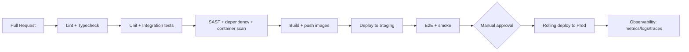

# SEHAT — Deployment, Docker, Kubernetes & CI/CD

Two paths: **(A) Cheapest — the shipped static PWA** (recommended, $0), and
**(B) Full enterprise stack** (FastAPI + Postgres + Redis + AI on Kubernetes).

---

## A. Cheapest deployment (shipped PWA) — $0/month

The app is fully static. Any of these host it for free:

### A.1 GitHub Pages (recommended)
1. Put the contents of `sehat/` at the root of a new repository (see the repo
   `README.md` for the one-shot extraction commands).
2. Push to `main`. The included workflow
   `.github/workflows/deploy-pages.yml` publishes it.
3. Enable **Settings → Pages → Source: GitHub Actions**.
4. Live at `https://<user>.github.io/<repo>/`.

> All paths in the app are **relative**, so it works from any sub-path without
> configuration.

### A.2 Other free static hosts
- **Cloudflare Pages / Netlify / Vercel:** drag-and-drop the `sehat/` folder, or
  point at the repo. No build command needed (output dir = repo root).
- **Local preview:** `python3 -m http.server 8080` then open
  `http://localhost:8080/`.

There is **no build step** and **no runtime dependency** — that is what makes it
the cheapest possible PWA.

---

## B. Full enterprise stack

### B.1 Dockerfiles

**Frontend (Next.js 15) — multi-stage:**
```dockerfile
# web/Dockerfile
FROM node:20-alpine AS deps
WORKDIR /app
COPY package*.json ./
RUN npm ci
FROM node:20-alpine AS build
WORKDIR /app
COPY --from=deps /app/node_modules ./node_modules
COPY . .
RUN npm run build
FROM node:20-alpine AS run
WORKDIR /app
ENV NODE_ENV=production
COPY --from=build /app/.next/standalone ./
COPY --from=build /app/.next/static ./.next/static
COPY --from=build /app/public ./public
EXPOSE 3000
CMD ["node", "server.js"]
```

**Backend (FastAPI):**
```dockerfile
# api/Dockerfile
FROM python:3.12-slim
WORKDIR /app
ENV PYTHONDONTWRITEBYTECODE=1 PYTHONUNBUFFERED=1
COPY requirements.txt .
RUN pip install --no-cache-dir -r requirements.txt
COPY . .
EXPOSE 8000
CMD ["uvicorn", "app.main:app", "--host", "0.0.0.0", "--port", "8000", "--workers", "4"]
```

### B.2 docker-compose (local full stack)
```yaml
services:
  web:
    build: ./web
    ports: ["3000:3000"]
    environment: [NEXT_PUBLIC_API_URL=http://localhost:8000/api/v1]
    depends_on: [api]
  api:
    build: ./api
    ports: ["8000:8000"]
    environment:
      - DATABASE_URL=postgresql+psycopg://sehat:sehat@db:5432/sehat
      - REDIS_URL=redis://cache:6379/0
      - OPENAI_API_KEY=${OPENAI_API_KEY}
    depends_on: [db, cache]
  db:
    image: pgvector/pgvector:pg16
    environment: [POSTGRES_USER=sehat, POSTGRES_PASSWORD=sehat, POSTGRES_DB=sehat]
    volumes: ["pgdata:/var/lib/postgresql/data"]
    ports: ["5432:5432"]
  cache:
    image: redis:7-alpine
    ports: ["6379:6379"]
volumes: { pgdata: {} }
```

### B.3 Kubernetes (excerpt — API deployment + service + HPA)
```yaml
apiVersion: apps/v1
kind: Deployment
metadata: { name: sehat-api, namespace: sehat }
spec:
  replicas: 3
  selector: { matchLabels: { app: sehat-api } }
  template:
    metadata: { labels: { app: sehat-api } }
    spec:
      containers:
        - name: api
          image: ghcr.io/kpu/sehat-api:1.0.0
          ports: [{ containerPort: 8000 }]
          envFrom: [{ secretRef: { name: sehat-secrets } }]
          readinessProbe: { httpGet: { path: /health, port: 8000 }, initialDelaySeconds: 5 }
          livenessProbe:  { httpGet: { path: /health, port: 8000 }, initialDelaySeconds: 10 }
          resources:
            requests: { cpu: "250m", memory: "256Mi" }
            limits:   { cpu: "1",    memory: "512Mi" }
---
apiVersion: v1
kind: Service
metadata: { name: sehat-api, namespace: sehat }
spec:
  selector: { app: sehat-api }
  ports: [{ port: 80, targetPort: 8000 }]
---
apiVersion: autoscaling/v2
kind: HorizontalPodAutoscaler
metadata: { name: sehat-api, namespace: sehat }
spec:
  scaleTargetRef: { apiVersion: apps/v1, kind: Deployment, name: sehat-api }
  minReplicas: 3
  maxReplicas: 20
  metrics:
    - type: Resource
      resource: { name: cpu, target: { type: Utilization, averageUtilization: 70 } }
```
Ingress terminates TLS (cert-manager), routes `/api` → `sehat-api`, `/` → `web`.
Secrets via Sealed Secrets / External Secrets + KMS. Service mesh (Istio/Linkerd)
provides mTLS between services.

### B.4 CI/CD pipeline



Stages: lint/type-check → test → security scan (Trivy, Bandit, `npm audit`) →
build & push (GHCR) → deploy staging → e2e → manual gate → canary/rolling prod →
post-deploy verification + auto-rollback on SLO breach.

---

## Cost summary

| Mode | Monthly cost | Best for |
|---|---|---|
| **Shipped static PWA** | **$0** (GitHub/Cloudflare Pages) | Pilot, demo, offline-first |
| Managed serverless (Cloud Run + Neon + Upstash) | low ($) | Small production |
| Full Kubernetes stack | $$–$$$ | Enterprise scale |
